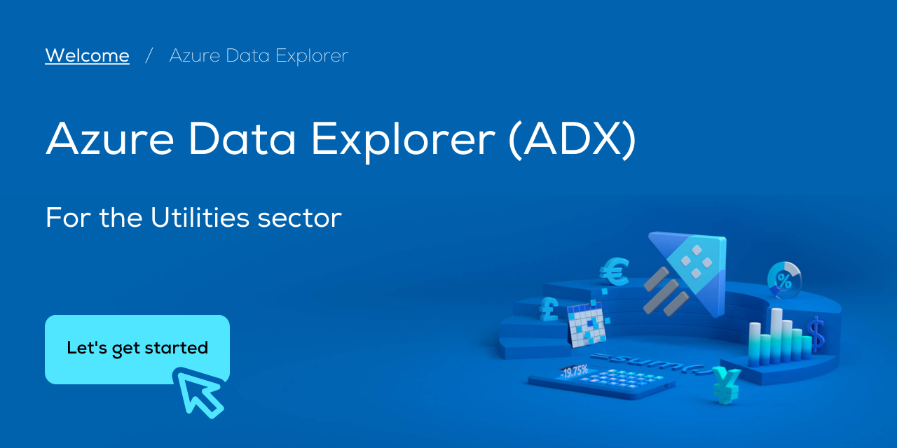
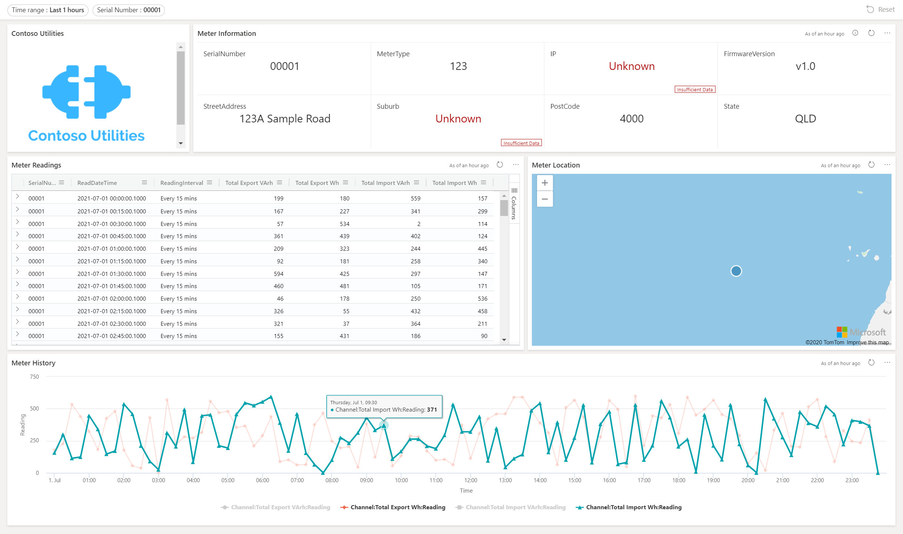

# 

## ADX 4 Utilities

👉 Data to dashboard: a demo of Azure Data Explorer (ADX) for the utilities sector.

[Azure Data Explorer](https://azure.microsoft.com/en-au/services/data-explorer) (ADX) is Microsoft's lighting fast, fully managed data analytics service for real-time terabyte-scale data analysis. It empowers adhoc queries across complex datasets to quickly identify patterns, trends, and anomalies in your data.

> 🚀 **Our Goal:**
> This demo focuses the implementation of Azure Data Explorer in the Utilities sector. We will explore how ADX can be used to ingest, query, and visualise sensor data to securely surface trends over time.

## Our Approach

1. Generate sample meter data.
2. Ingest (and transform) meter data into Azure Data Explorer.
3. Configure ingestion policies to backdate datasets.
4. Run adhoc queries and gain insights from the meter data.
5. Build a utilities dashboard to visualise our queries.

## Dataset: Electricity Meter Data

In this demo, we will be working with fake electricity meter reading data. A Python script is included to generate datasets similar to those an electricity meter generates before it sends the data to the cloud.

💡 Run the included [Data Generator](generator/DataGenerator.py) script to generate a fake dataset of meter readings.

See [understanding the dataset](Dataset.md) for more information.

## Azure: Deploying the Resources

We will be working with two resources, a storage account to hold our raw data (could be replaced with another storage or streaming service) and Azure Data Explorer Cluster.
💡 Follow the [setting up Azure resources](ADX.md) guide to get started.

## Outcome: Meter Dashboard & Integrations

Dashboards in ADX allow us to place queries into tiles and visually make meaning of the data. A simple dashboard could feature:

- Timerange and meter serial filter to narrow down our data
- Markdown-enabled tile, here used to show the company logo
- A multi-row grid with information about the currently selected meter
- A table of the meter's reading value (according to filters)
- The location of the electricity meter on a cluster map
- Timeseries chart to visualise the table's meter reads over time

